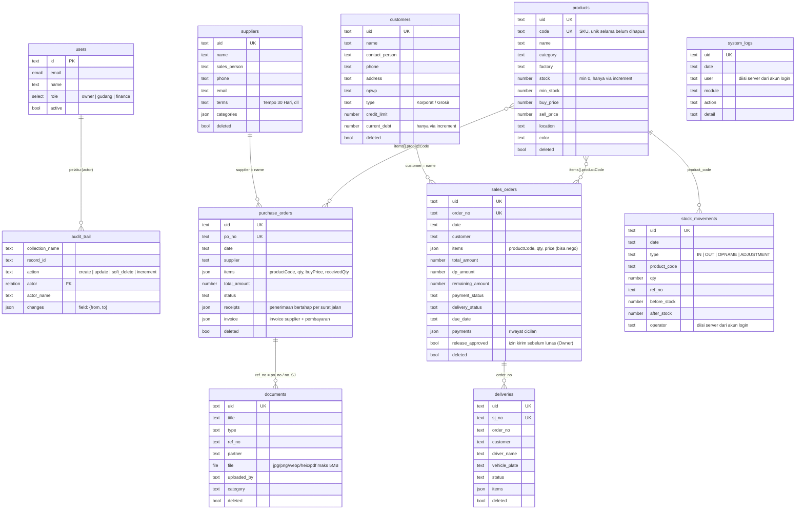

# Skema Database PALORA

Backend: **PocketBase 0.40** (SQLite). Definisi lengkap ada di
[`backend/pb_migrations/1700000000_palora_schema.js`](../backend/pb_migrations/1700000000_palora_schema.js),
aturan bisnis server di [`backend/pb_hooks/palora.pb.js`](../backend/pb_hooks/palora.pb.js).

## Prinsip desain

| Prinsip | Penerapan |
|---|---|
| Mengikuti alur kerja yang ada (PRD §10) | Nomor dokumen, status, dan format tetap seperti kebiasaan Paletindo (PO-037/PIM/2026, 0062/DO/PIM/V/2026). |
| Tidak ada hapus permanen (NFR 7.3) | `deleteRule = null` di semua tabel bisnis. Hapus = `deleted = true` (soft delete). |
| Stok selalu benar walau dipakai banyak perangkat | `products.stock` **tidak bisa** diubah lewat update biasa. Perubahan stok wajib lewat endpoint atomik `POST /api/palora/increment` (transaksi database, menolak stok minus). |
| Audit trail (Modul 9) | Setiap create/update/increment otomatis dicatat ke `audit_trail` oleh server, lengkap dengan nama pelaku & nilai sebelum/sesudah. |
| Detail baris disimpan bersama dokumennya | `items`, `payments`, `receipts`, `invoice` berupa kolom JSON: selalu dibaca/ditulis bersama induknya, jadi tidak perlu tabel detail terpisah. |
| Kolom `uid` | ID yang dipakai aplikasi (mis. `PRD-0001`, `ORD-...`). `id` adalah ID internal PocketBase. |
| Kolom `extra` (JSON) | Menampung atribut tambahan dari UI yang belum punya kolom sendiri, supaya tidak ada data yang hilang. |

## Diagram relasi (ERD)

Relasi antar dokumen bisnis memakai **nomor dokumen** (bukan foreign key), sama seperti
dokumen fisik Paletindo yang saling merujuk lewat nomor.

Semua tabel juga punya kolom otomatis `created` dan `updated`.

## Hak akses per tabel (PRD 6.7)

| Tabel | Lihat | Tambah | Ubah | Hapus |
|---|---|---|---|---|
| products | semua | Owner, Gudang | Owner, Gudang (kecuali `stock`) | — |
| customers | semua | semua | semua (kecuali `current_debt`) | — |
| suppliers | semua | semua | semua | — |
| sales_orders | semua | Owner, Gudang | semua (Keuangan mencatat pembayaran); `release_approved` hanya Owner | — |
| purchase_orders | semua | Owner, Gudang | semua (Keuangan mencatat invoice & bayar supplier) | — |
| deliveries | semua | Owner, Gudang | Owner, Gudang | — |
| documents | semua | semua | semua | — |
| stock_movements | semua | Owner, Gudang | — (tidak bisa diubah) | — |
| system_logs | Owner | semua | — | — |
| audit_trail | Owner | hanya server | — | — |
| users | diri sendiri / Owner | Owner | Owner (user biasa hanya nama & password sendiri) | Owner |

Endpoint `POST /api/palora/increment`:
- `products.stock`: Owner & Gudang, ditolak bila hasilnya minus (*"Stok tidak cukup ... tersedia X pcs"*).
- `customers.current_debt`: semua role, dibulatkan ke 0 bila minus.

## Aturan bisnis di server

1. **Surat jalan hanya untuk pesanan lunas** (F-SO04). Kalau masih ada sisa tagihan, server menolak, kecuali Owner menyalakan `release_approved` (tombol *Izinkan Kirim* di modul Penjualan).
2. **Nama operator tidak bisa dipalsukan**: kolom `user` di `system_logs` dan `operator` di `stock_movements` ditimpa server dengan nama akun yang login.
3. **Login hanya untuk akun aktif** (`authRule: active = true`), dengan sesi berakhir otomatis setelah 8 jam.
4. **Nomor dokumen unik** (PO, nota, surat jalan, kode SKU) selama belum dihapus.
